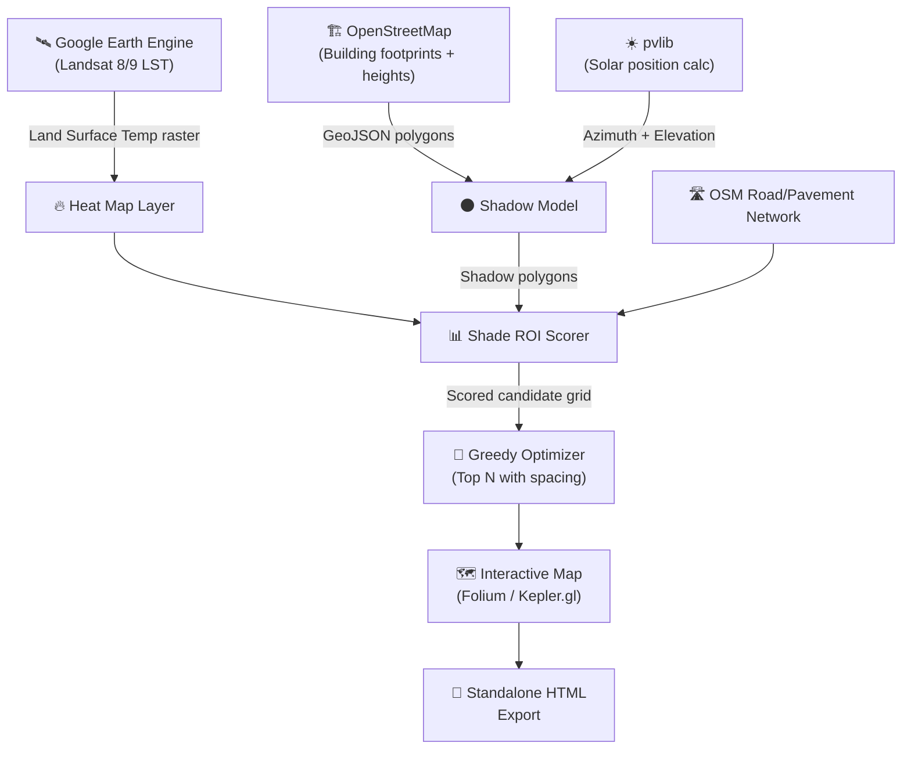

# 🌳 Urban Heat Island Tree Canopy Optimizer — Build Guide

## Project Vision (Recap)

**Problem:** Cities plant trees randomly. They don't know mathematically where a tree will have the highest cooling impact on deadly summer heat.

**Solution:** An AI system that analyzes thermal satellite data + building geometry to identify the exact optimal planting locations that maximize shade on hot asphalt surfaces.

**Why this is a killer portfolio project for ML:**
- Combines CV, geospatial ML, optimization algorithms, and real-world impact
- Uses professional-grade data sources (Landsat, OpenStreetMap, Google Earth Engine)
- Has a clear "before vs. after" story for presentations
- Publishable as a whitepaper or blog post
- Pitchable to NGOs and city governments

---

## MVP Scope — What You're Actually Building in 8 Weeks

### The MVP delivers ONE thing:

> **Input:** A neighborhood boundary (lat/lng bounding box)
> **Output:** An interactive map showing the top 50–100 optimal tree planting locations, ranked by "Shade ROI" score, with a heatmap overlay of current surface temperatures.

### What's IN the MVP:

1. ✅ Fetch Land Surface Temperature (LST) from Landsat 8/9 via Google Earth Engine
2. ✅ Fetch building footprints + heights from OpenStreetMap
3. ✅ Calculate sun trajectories for peak summer (solar azimuth/elevation)
4. ✅ Model building shadows to find un-shaded hot pavement
5. ✅ Score candidate locations by "Shade ROI" (surface temp × sun exposure × pavement area)
6. ✅ Rank and select top N locations with spacing constraints
7. ✅ Display results on an interactive Folium/Kepler.gl map
8. ✅ Export as a standalone HTML file (shareable, no server needed)

### What's NOT in the MVP:

- ❌ No web app / API / database
- ❌ No street-level imagery (Google Street View API costs money)
- ❌ No CNN/deep learning model (the optimization algorithm IS the ML — don't overcomplicate it)
- ❌ No real-time data (use summer 2024/2025 Landsat composites)
- ❌ No multi-city support (pick ONE neighborhood, nail it)
- ❌ No whitepaper yet (that's v1.1)

---

## Architecture



---

## Tech Stack

| Layer | Library | Purpose | Install |
|---|---|---|---|
| **Satellite Data** | `earthengine-api` + `geemap` | Fetch Landsat LST data from Google Earth Engine | `pip install earthengine-api geemap` |
| **Geospatial Core** | `geopandas` + `shapely` | Spatial operations, geometry, intersections | `pip install geopandas` |
| **Building Data** | `osmnx` | Download OpenStreetMap buildings & roads | `pip install osmnx` |
| **Shadow Modeling** | `pybdshadow` | Project building footprints into shadow polygons | `pip install pybdshadow` |
| **Solar Position** | `pvlib` | Calculate sun azimuth/elevation for any time + location | `pip install pvlib` |
| **Raster Processing** | `rasterio` + `numpy` | Handle thermal raster data | `pip install rasterio` |
| **Visualization** | `folium` or `keplergl` | Interactive web maps | `pip install folium` |
| **Data Handling** | `pandas` | Tabular data, scoring, ranking | (comes with geopandas) |
| **Notebooks** | `jupyter` | Development + presentation | `pip install jupyter` |

### One-line install:

```bash
pip install earthengine-api geemap geopandas osmnx pybdshadow pvlib rasterio numpy folium pandas jupyter matplotlib
```

> [!NOTE]
> **Google Earth Engine** requires a free Google Cloud account and authentication. Sign up at [earthengine.google.com](https://earthengine.google.com/). It's free for research/personal use. Run `earthengine authenticate` once to set up.

---

## Week-by-Week Build Plan

### Week 1: Setup + "Hello Satellite" (4–6 hrs)

**Goal:** Authenticate with GEE, fetch thermal data for one neighborhood, visualize it.

**Pick your study area first:**
Choose a neighborhood you know well (your city, or a well-documented UHI city like Phoenix, Delhi, or Tokyo). You need a bounding box — get it from [bboxfinder.com](http://bboxfinder.com/).

**Tasks:**
- [ ] Create a Python virtual environment and install all dependencies
- [ ] Sign up for Google Earth Engine (if not already)
- [ ] Run `earthengine authenticate` and `ee.Initialize()`
- [ ] Write a notebook that:
  - Defines your study area as an `ee.Geometry.Rectangle`
  - Loads `LANDSAT/LC09/C02/T1_L2` collection
  - Filters to summer months (June–August) of the latest year
  - Calculates median Land Surface Temperature (Band 10, apply scale factors)
  - Visualizes the LST heatmap with `geemap` in the notebook

**Key code snippet (starter):**
```python
import ee
import geemap

ee.Authenticate()
ee.Initialize(project='your-project-id')

# Define study area (example: central Phoenix)
bbox = ee.Geometry.Rectangle([-112.08, 33.43, -112.04, 33.47])

# Load Landsat 9 Level-2 surface temperature
l9 = (ee.ImageCollection("LANDSAT/LC09/C02/T1_L2")
      .filterBounds(bbox)
      .filterDate('2024-06-01', '2024-08-31')
      .map(lambda img: img.multiply(0.00341802).add(149.0).subtract(273.15))  # Scale to °C
      .median()
      .clip(bbox))

# Visualize
Map = geemap.Map()
Map.centerObject(bbox, 15)
Map.addLayer(l9.select('ST_B10'), 
             {'min': 25, 'max': 55, 'palette': ['blue', 'yellow', 'red']}, 
             'Surface Temperature °C')
Map.addLayerControl()
Map
```

> [!TIP]
> The scale factor above is approximate. Check the [official Landsat Collection 2 docs](https://www.usgs.gov/landsat-missions/landsat-collection-2-level-2-science-products) for exact band math. The thermal band is `ST_B10`.

**Deliverable:** A Jupyter notebook showing a thermal heatmap of your neighborhood. You should see hot spots (parking lots, asphalt roads) vs. cool spots (parks, water). Screenshot this — it's your first demo image.

---

### Week 2: Building Shadows (4–6 hrs)

**Goal:** Download buildings from OSM, calculate shadows for peak summer afternoon.

**Tasks:**
- [ ] Use `osmnx` to download building footprints for your study area
- [ ] Inspect the data — how many buildings have `height` attributes? (Many won't; use a default of 10m)
- [ ] Use `pvlib` to calculate solar position for July 15 at 2:00 PM local time
- [ ] Use `pybdshadow` to generate shadow polygons from building footprints
- [ ] Visualize buildings (gray) + shadows (dark) on a Folium map
- [ ] Overlay the LST heatmap from Week 1

**Key code snippet:**
```python
import osmnx as ox
import pybdshadow
import pandas as pd
from pvlib import solarposition

# Download buildings
buildings = ox.features_from_bbox(bbox=(33.47, 33.43, -112.04, -112.08), 
                                   tags={'building': True})

# Fill missing heights with default
buildings['height'] = buildings['height'].fillna(10).astype(float)

# Calculate solar position (July 15, 2PM local)
times = pd.DatetimeIndex(['2024-07-15 14:00:00'], tz='America/Phoenix')
solpos = solarposition.get_solarposition(times, 33.45, -112.06)
sun_azimuth = solpos['azimuth'].iloc[0]
sun_elevation = solpos['apparent_elevation'].iloc[0]

# Generate shadows
shadows = pybdshadow.bdshadow_sunlight(buildings, 
                                         date=pd.Timestamp('2024-07-15 14:00:00'),
                                         roof=False)
```

**Deliverable:** A map showing buildings + their shadow footprints at peak sun. The areas NOT in shadow are your "hot zones."

---

### Week 3: Pavement Detection + Candidate Grid (4–6 hrs)

**Goal:** Identify pavement/asphalt surfaces and create a grid of candidate planting locations.

**Tasks:**
- [ ] Use `osmnx` to download road networks and parking areas
- [ ] Use NDVI (from Landsat) to create a vegetation mask (NDVI < 0.2 = bare/paved)
- [ ] Combine: areas that are (a) paved/road surface, (b) NOT in building shadow, (c) high LST
- [ ] Generate a regular grid of candidate points (every 15m) across the study area
- [ ] Filter out candidates that fall on buildings, water, or existing tree canopy (NDVI > 0.4)

**Architecture of the candidate filter:**
```
All grid points (every 15m)
  └── Remove: inside buildings ❌
  └── Remove: inside water bodies ❌  
  └── Remove: existing tree canopy (NDVI > 0.4) ❌
  └── Remove: not near pavement (>20m from road) ❌
  └── Keep: remaining candidates ✅ → These are your plantable spots
```

**Deliverable:** A map with dots showing all valid candidate planting locations. There should be hundreds to thousands of them.

---

### Week 4: Shade ROI Scoring Algorithm (4–6 hrs)

**Goal:** Score every candidate location by how much cooling impact a tree planted there would provide.

**This is the core ML/algorithm of the project.**

**The Shade ROI formula:**

```
Shade_ROI(point) = LST_score × Exposure_score × Pavement_score × Pedestrian_score

Where:
  LST_score       = normalized surface temperature at point (0–1, hotter = higher)
  Exposure_score  = hours of direct sun exposure per day (0–1, more sun = higher)
  Pavement_score  = fraction of asphalt/road within tree shade radius (15m)
  Pedestrian_score = proximity to sidewalks/crosswalks (bonus for foot traffic areas)
```

**Tasks:**
- [ ] Extract LST value at each candidate point (from the GEE raster)
- [ ] Calculate sun exposure: run the shadow model for multiple times of day (8AM, 10AM, 12PM, 2PM, 4PM) and count how many hours each point is in direct sun
- [ ] Calculate pavement fraction: buffer each point by 15m (typical tree canopy radius), intersect with road polygons, compute area ratio
- [ ] (Optional) Add pedestrian bonus: points near sidewalks or bus stops get a multiplier
- [ ] Normalize all scores to 0–1 and compute the composite Shade ROI
- [ ] Rank all candidates by Shade ROI

**Deliverable:** A GeoDataFrame with columns: `geometry`, `lst_score`, `exposure_hours`, `pavement_frac`, `shade_roi`. Visualize the top 200 candidates as a heatmap.

---

### Week 5: Greedy Optimizer + Spacing (4–6 hrs)

**Goal:** Select the top N planting locations with a minimum spacing constraint (you don't want 10 trees in a cluster).

**Algorithm (Greedy with spacing):**

```python
def select_optimal_locations(candidates_gdf, n=100, min_spacing_m=30):
    """
    Greedy selection: pick the highest Shade ROI point,
    then remove all candidates within min_spacing_m,
    repeat until we have n locations.
    """
    selected = []
    remaining = candidates_gdf.sort_values('shade_roi', ascending=False).copy()
    
    while len(selected) < n and len(remaining) > 0:
        # Pick the best remaining candidate
        best = remaining.iloc[0]
        selected.append(best)
        
        # Remove all candidates within min_spacing_m of the selected point
        distances = remaining.geometry.distance(best.geometry)
        remaining = remaining[distances > min_spacing_m]
    
    return gpd.GeoDataFrame(selected, crs=candidates_gdf.crs)
```

**Tasks:**
- [ ] Implement the greedy optimizer
- [ ] Experiment with `n` (50, 100, 200) and `min_spacing_m` (20, 30, 50)
- [ ] Visualize the selected locations on the map with numbered markers
- [ ] Calculate summary stats: total predicted shade area, average LST at selected locations, estimated temperature reduction

> [!TIP]
> This greedy approach is simple but effective. For the whitepaper (post-MVP), you can compare it against random placement and show the improvement. That's your "4°F better than random" claim.

**Deliverable:** A map with exactly 100 numbered markers showing optimal planting locations. Each marker has a popup with its Shade ROI score and component breakdown.

---

### Week 6: Interactive Map + Layers (4–6 hrs)

**Goal:** Build a polished, interactive Folium map with toggle-able layers.

**Layers to include:**
1. **Base:** OpenStreetMap tiles
2. **LST Heatmap:** Thermal overlay (semi-transparent)
3. **Building Shadows:** Shadow polygons at 2PM (dark overlay)
4. **Candidate Grid:** All candidates (small gray dots)
5. **Selected Locations:** Top 100 optimal spots (green markers with scores)
6. **Stats Panel:** Legend + summary statistics

**Tasks:**
- [ ] Create a multi-layer Folium map
- [ ] Add layer toggle controls (Folium `LayerControl`)
- [ ] Add popups to each selected location with: rank, Shade ROI, LST, exposure hours
- [ ] Add a title/legend HTML overlay
- [ ] Export as a standalone `.html` file
- [ ] Test: does it look good on a phone/tablet? (Folium maps are responsive)

**Deliverable:** A single `tree_canopy_optimizer_results.html` file that anyone can open in a browser. This is your demo artifact.

---

### Week 7: Comparison Analysis + Visuals (4–6 hrs)

**Goal:** Prove your optimizer works by comparing against random placement.

**Tasks:**
- [ ] Generate 100 random planting locations (within valid candidate zones)
- [ ] Calculate the total Shade ROI for random vs. optimized
- [ ] Calculate estimated temperature reduction for both strategies
- [ ] Create comparison visualizations:
  - Side-by-side maps (random vs. optimized)
  - Bar chart: total shade area, avg LST coverage, estimated cooling
  - Scatter plot: Shade ROI distribution
- [ ] Write up the key finding: "Optimized placement achieves X% more cooling per tree than random placement"

**Deliverable:** 3–4 publication-quality matplotlib/seaborn charts showing optimized > random. These go in your README and LinkedIn post.

---

### Week 8: Package, Document, Ship (4–6 hrs)

**Goal:** Make it a presentable GitHub repo + LinkedIn post.

**Repo structure:**
```
tree-canopy-optimizer/
├── README.md                  # Hero image, problem statement, results, how to run
├── LICENSE                    # MIT
├── requirements.txt           # All dependencies
├── notebooks/
│   ├── 01_fetch_thermal.ipynb     # Week 1
│   ├── 02_building_shadows.ipynb  # Week 2
│   ├── 03_candidate_grid.ipynb    # Week 3
│   ├── 04_shade_roi.ipynb         # Week 4
│   ├── 05_optimizer.ipynb         # Week 5
│   └── 06_visualization.ipynb     # Week 6-7
├── src/
│   ├── config.py              # Study area bbox, parameters
│   ├── data_fetch.py          # GEE + OSM data acquisition
│   ├── shadow_model.py        # Shadow calculation
│   ├── shade_roi.py           # Scoring algorithm
│   ├── optimizer.py           # Greedy selection
│   └── visualize.py           # Map generation
├── results/
│   ├── optimal_locations.geojson
│   ├── comparison_charts/
│   └── interactive_map.html
└── docs/
    └── methodology.md         # Brief writeup of the approach
```

**Tasks:**
- [ ] Refactor notebook code into `src/` modules
- [ ] Write a proper `README.md`:
  - Hero screenshot (the interactive map)
  - Problem statement (1 paragraph)
  - Key result: "X% more effective than random placement"
  - How to run (3 steps)
  - Tech stack badges
  - Methodology summary
  - "Future Work" section
- [ ] Record a 30-second GIF scrolling through the interactive map
- [ ] Push to GitHub
- [ ] Write LinkedIn post (template below)

**LinkedIn post template:**
```
🌳 Built an AI system that optimizes urban tree planting to combat heat islands.

The problem: Cities plant trees randomly. My system uses satellite thermal 
data + building shadow modeling to find the exact locations where a new tree 
will have the maximum cooling impact.

Results: Optimized placement achieves [X]% more cooling per tree than 
random placement on [neighborhood name].

Tech: Python, Google Earth Engine (Landsat 9), GeoPandas, pvlib solar 
modeling, custom greedy optimization algorithm.

Full code + interactive map: [GitHub link]

#MachineLearning #ClimateAdaptation #Geospatial #UrbanPlanning
```

---

## Key Concepts to Learn (Project-Specific)

You probably already know most of these, but here's what's specific to this project:

| Concept | Where you'll need it | Time to learn |
|---|---|---|
| **Google Earth Engine API** | Week 1 — fetching Landsat data | 2-3 hours. GEE is weird (server-side objects, lazy evaluation). Read the [Python quickstart](https://developers.google.com/earth-engine/guides/python_install) |
| **Coordinate Reference Systems (CRS)** | Everywhere — you'll hit CRS mismatch errors | 1 hour. Know the difference between EPSG:4326 (lat/lng) and a projected CRS (meters). Always project to meters before distance calculations |
| **NDVI calculation** | Week 3 — vegetation masking | 30 min. `(NIR - Red) / (NIR + Red)`. Landsat bands B4 (red) and B5 (NIR) |
| **GeoPandas spatial joins** | Week 3-4 — intersecting shadows with roads | 1 hour. `gpd.sjoin()`, `.intersection()`, `.buffer()` |
| **Solar position math** | Week 2 — shadow direction/length | 30 min. `pvlib` handles this. You just need azimuth (compass direction) and elevation (angle above horizon) |
| **Greedy optimization** | Week 5 — location selection | You already know this concept. The spacing constraint is the only twist |

---

## Reading List (Before You Start)

### 1. Google Earth Engine Python Quickstart
📖 https://developers.google.com/earth-engine/guides/python_install

Get authenticated and run your first query. **Do this in Week 1, Day 1.** Everything else depends on it.

**Time: 1 hour**

### 2. GeoPandas User Guide — Intro + Spatial Joins
📖 https://geopandas.org/en/stable/docs/user_guide.html

If you haven't used GeoPandas before, read the intro sections. If you have, skip to "Merging Data / Spatial Joins."

**Time: 1 hour**

### 3. pybdshadow Documentation + Examples
📖 https://pybdshadow.readthedocs.io/

This library does the heavy lifting for shadow calculation. Read the examples — there are only ~3 pages. The `bdshadow_sunlight` function is what you need.

**Time: 30 minutes**

### 4. (Optional) Sofia Ermida's Landsat LST Repository
📖 https://github.com/sofiaermida/Landsat_SMW_LST

A well-regarded open-source implementation for computing Land Surface Temperature from Landsat in Google Earth Engine. If the basic scale-factor approach from Week 1 feels too rough, use this for more accurate LST.

**Time: 1 hour (only if you want higher accuracy)**

---

## Post-MVP Evolution

| Version | What to add | Portfolio impact |
|---|---|---|
| **v1.1** | Write a methodology blog post / whitepaper | Shows you can communicate research |
| **v1.2** | Add a Streamlit web interface | Now it's a "tool" not just a notebook |
| **v1.3** | Support any city — parameterize the bounding box | Makes it actually useful |
| **v2.0** | Use CNN (U-Net) to segment tree canopy from aerial imagery | Adds real deep learning to the project |
| **v2.1** | Multi-time-period analysis — show seasonal variation | More robust results |
| **v3.0** | Pitch to a local NGO as a free tool, publish actual results | Career-defining piece |

---

## FAQ / Gotchas

**Q: Do I need a GPU?**
No. There's no deep learning in the MVP. All computation is geospatial math + numpy. A laptop is fine.

**Q: Does Google Earth Engine cost money?**
No. It's free for research, education, and personal projects. You need a Google Cloud project but don't need to enable billing.

**Q: What if my neighborhood doesn't have building heights in OSM?**
Most cities don't have full height data. Use a default height (10m for residential, 20m for commercial). For the MVP, this approximation is fine. Mention it as a limitation in your README.

**Q: Should I use Kepler.gl or Folium for the map?**
Start with **Folium** — it's simpler and pure Python. Kepler.gl looks fancier but has heavier dependencies and can be flaky in notebooks. Switch to Kepler.gl in v1.2 if you want.

**Q: What city should I pick?**
Pick one you know (easier to sanity-check results), OR pick a well-documented UHI city like **Phoenix, AZ** (excellent Landsat coverage, extreme heat, lots of research to compare against). If you're in India, **Delhi, Ahmedabad, or Nagpur** are great choices with severe UHI and active tree-planting programs.
